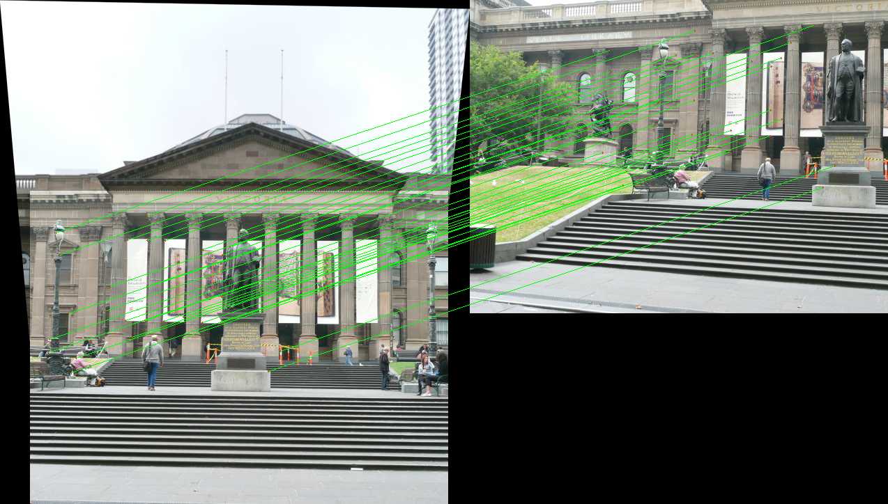

# Corner Detection and Image Stitching
Create a panoramic image from multiple images using Feature detection, Non Maximum Suppression, Feature Matching using feature descriptors and RANSAC.
<p align="center">
 
</p>

<p align="center">
 
</p>

<p align="center">
 
</p>


## Dependencies
Ensure you have the following dependencies installed:
```bash
pip install numpy opencv-python matplotlib scikit-image
```
## Pipeline
This project implements corner detection, feature matching, and homography estimation for image stitching using Python and OpenCV. The main steps include:
- **Corner Detection**: Harris Corner Detection and Adaptive Non-Maximal Suppression (ANMS)
<p float="center">
 
 
</p>
<p float="left">
 
 
</p>

- **Feature Description and Matching**: Generating descriptors and matching features using Euclidean distance
<p float="left">
 
 
</p>

- **Homography Estimation**: Using RANSAC to filter outliers and compute the transformation matrix
<p float="left">
 
 
</p>

- **Image Stitching**: Warping and blending images to create a panorama
<p align="center">
 
</p>

## Features
- Harris Corner Detection
- Adaptive Non-Maximal Suppression (ANMS)
- Feature Descriptor Extraction
- Feature Matching with Euclidean Distance
- Homography Estimation using Direct Linear Transform (DLT)
- RANSAC for Outlier Removal
- Image Warping and Blending

## Dependencies
Ensure you have the following dependencies installed:
```bash
pip install numpy opencv-python matplotlib scikit-image
```

## Usage
### Running the Code
Use the script to process images and perform image stitching:
```bash
python3 wrapper.py --Set 3
```

### Arguments
- `--Set`: The Set of Images to be used. Choose 1,2 or 3

## Author
Dhrumil Kotadia

## License
This project is licensed under the MIT License.


